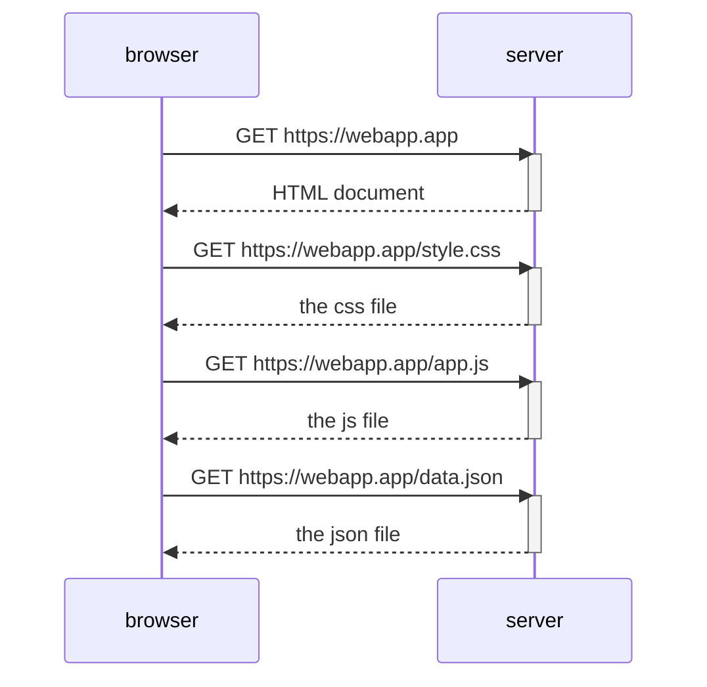

```mermaid
sequenceDiagram
    participant browser
    participant server

    browser->>server: GET https://webapp.app
    activate server
    server-->>browser: HTML document
    deactivate server

    browser->>server: GET https://webapp.app/style.css
    activate server
    server-->>browser: the css file
    deactivate server

    browser->>server: GET https://webapp.app/app.js
    activate server
    server-->>browser: the js file
    deactivate server

    browser->>server: GET https://webapp.app/data.json
    activate server
    server-->>browser: the json file
    deactivate server
```